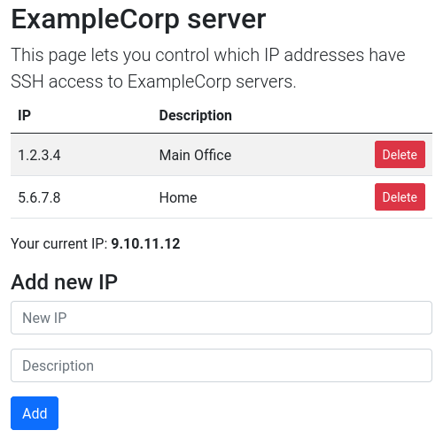

# awsipacl


A webapp that lets you manage the IPs associated with a specific port in an AWS VPC security group. For example, you could control which IP addresses can SSH into an EC2 server.

It runs as an AWS Lambda function behind an Amazon API Gateway, with usage low enough to effectively be free. (less than a cent per month)

## Setup
### Configuration
Go to "Security Groups" in the [VPC console](https://console.aws.amazon.com/vpc/home) and find the security group you want to connect with this app. Make a note of its security group ID.

Copy the `config-sample.toml` file in this repository into a new `config.toml` file. The configuration options are:

* `PasswordHash` - the bcrypt password hash, used at the password screen
* `SecurityGroupID` - the target security group ID
* `Region` - the AWS region with your security group
* `Port` - the port to control access to (for example, 22 for SSH)
* `Protocol` - the protocol (either `tcp` or `udp`) to control access to (for example, `tcp` for SSH)
* `Title` - the title, which will be displayed at the top of the screen when a user logs in
* `Description` - the description, which will be displayed under the title when a user logs in

### Deployment
> Eventually, this should probably be replaced by some Terraform files or something similar. For now it's a bunch of manual clicking of things on various AWS consoles.

First, make sure you have Go 1.16 or newer installed. Older versions of Go will not work. You'll also need to install the [AWS CLI version 2](https://docs.aws.amazon.com/cli/latest/userguide/install-cliv2.html) and [configure it](https://docs.aws.amazon.com/cli/latest/userguide/cli-configure-quickstart.html).

Then, from the [Lambda console](https://console.aws.amazon.com/lambda/home), create a new function. Select "Author from scratch", give it a name, and select "Amazon Linux 2" (OS-only runtime) as the runtime. You can keep architecture as "x86_64".

Open up the newly-created function, and, in the "Code" tab, edit the "Runtime settings". Set the "Handler" to "awsipacl". Also, in the "Configuration" tab, edit the memory to 128 MB.

In the "Configuration" tab, select "Permissions", and then click on the role under "Role name". This will open a new tab in the IAM console. From there, click "Add permissions", then "Create inline policy". Select the JSON policy editor and paste the following in (MAKE SURE TO REPLACE `SECURITY-GROUP-ID-HERE` with your security group ID, including the `sg-` prefix):

```json
{
	"Version": "2012-10-17",
	"Statement": [
		{
			"Action": [
				"ec2:AuthorizeSecurityGroupEgress",
				"ec2:AuthorizeSecurityGroupIngress",
				"ec2:RevokeSecurityGroupEgress",
				"ec2:RevokeSecurityGroupIngress"
			],
			"Effect": "Allow",
			"Resource": "arn:aws:ec2:*:*:security-group/SECURITY-GROUP-ID-HERE"
		},
		{
			"Action": [
				"ec2:DescribeSecurityGroups"
			],
			"Effect": "Allow",
			"Resource": "*"
		}
	]
}
```

Click "Next". Give the policy a name (ideally matching the name of your Lambda function) and click "Create policy". You should now see your policy attached to the role.

Now, go to the [API Gateway console](https://console.aws.amazon.com/apigateway/home), and build a new HTTP API. Add your Lambda function as an integration. Give the API the same name as your function. Set the resource path to "/{proxy+}". Leave the rest of the settings as their defaults.

In a terminal, go to this folder and run `GOOS=linux go build .`, followed by `zip awsipacl.zip awsipacl`. Then run `aws lambda update-function-code --function-name FUNCTION-NAME-HERE --zip-file fileb://./awsipacl.zip`, but replace FUNCTION-NAME-HERE with the name of your Lambda function.

At this point, you should be done! Going to your API Gateway's endpoint should result in a "please enter password" screen. If you want, you can go to the API Gateway settings and add a custom domain name. (if you do that, you'll also want to get an HTTPS certificate for your domain from the [ACM console](https://console.aws.amazon.com/acm/home))

## Development
To upload changes, just do the same build and update steps from the "deployment" section, which have been repeated here:

* `GOOS=linux go build .`
* `zip awsipacl.zip awsipacl`
* `aws lambda update-function-code --function-name FUNCTION-NAME-HERE --zip-file fileb://./awsipacl.zip`

Make sure to replace FUNCTION-NAME-HERE with the name of your Lambda function! Also, note that everything in the `frontend/` folder will be automatically embedded into the binary and uploaded to Lambda.